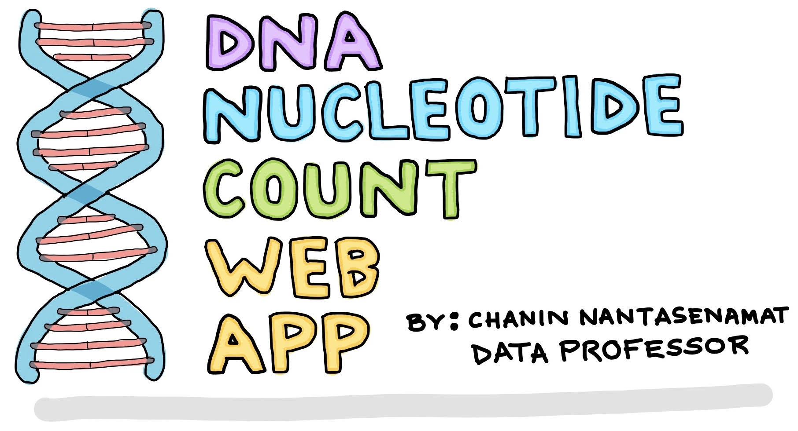

# Simple bioinformatics DNA App

* Shown are the simple **bioinformatics DNA** 
* feat create a simple simple bioinformatics dna, to studie data science.
> Exercises to: https://youtu.be/JwSS70SZdyM 
> https://github.com/dataprofessor/streamlit_freecodecamp/tree/main/app_2_simple_bioinformatics_dna

* DNA Logo:

# Streamlit on Docker
## Run Streamlit
### Run the app script

Run `docker-compose up --build` to run `src/app.py` in Streamlit.

then open [localhost:8501/?name=app](http://localhost:8501/?name=app) in your browser. 